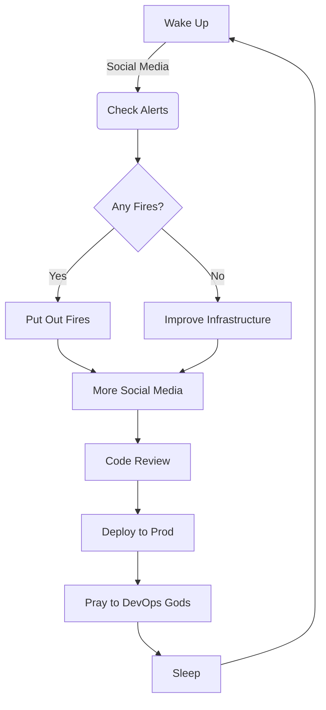

# Adithya Vardhan G

## 💫 About Me:
🔭 **I’m currently working on:**  
Improving cloud-based DevOps solutions and integrating robust CI/CD pipelines using Docker, Kubernetes, and Jenkins.  
👯 **I’m looking to collaborate on:**  
Projects involving cloud infrastructure, automation, and full-stack development.  
🌱 **I’m currently learning:**  
Full-stack web development to enhance my understanding of front-end and back-end interactions.  
💬 **Ask me about:**  
AWS, Docker, Kubernetes, Ansible, Terraform, and all things DevOps.  
⚡ **Fun fact:**  
I thrive on automating everything that can be automated!

## 🌐 Socials:
 

# 💻 Tech Stack:
             

## 💡 A Typical Day in My Life:

### ✍️ Random Dev Quote

---

<!-- Proudly created with GPRM ( https://gprm.itsvg.in ) -->
